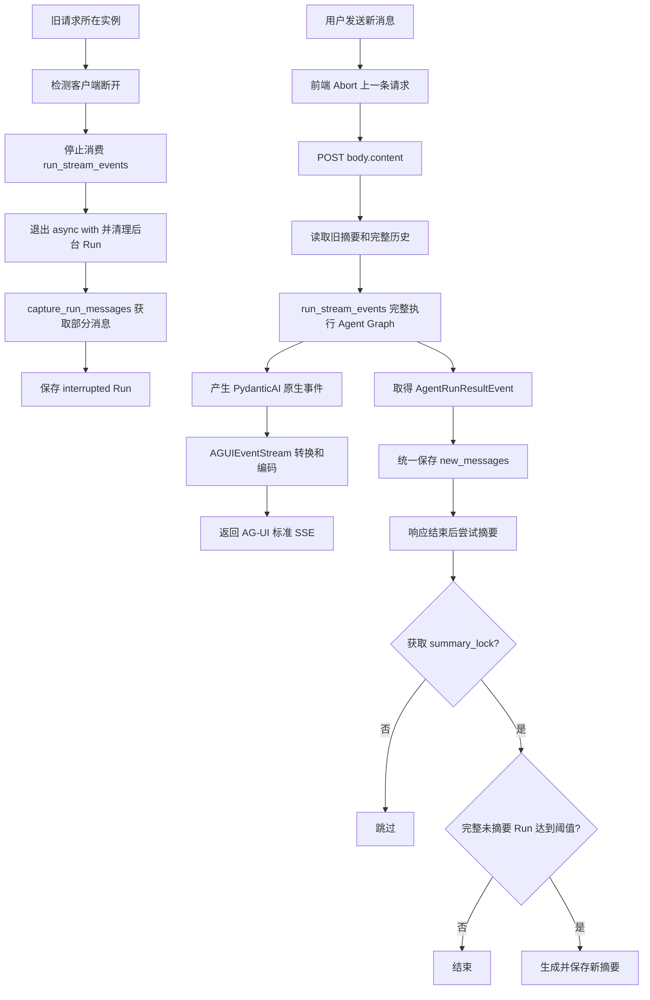

# PydanticAI 多轮对话与滚动摘要技术方案（最终版）

> 文档版本：3.2  
> 基线日期：2026-07-11  
> 技术栈：FastAPI、PydanticAI、SQLAlchemy Async、PostgreSQL、Redis  
> 数据表约束：仅使用 `chat_session`、`chat_message` 两张业务表  
> 流式输出协议：AG-UI 标准事件（仅输出侧，不接管用户输入和历史）

---

## 1. 目标

实现一套主线清晰、可直接落地的多轮对话方案：

- 使用 PydanticAI 原生 `ModelMessage` 保存历史；
- 支持多会话、多轮上下文恢复；
- 支持 HTTP 流式响应，并统一返回 AG-UI 标准事件；
- 前端发送新消息时中断上一条流；
- 正常 Run 和中断 Run 都持久化；
- 中断 Run 只用于展示，不进入模型上下文和摘要；
- 摘要后置执行，不阻塞主对话；
- 支持多实例下的幂等写入和摘要互斥；
- 仅使用 `chat_session`、`chat_message` 两张业务表。

---

## 2. 核心设计

### 2.1 一条 `chat_message` 保存一次 Agent Run

运行时取得当前 Run 新产生的原生消息：

```python
new_messages: list[ModelMessage] = result.new_messages()
```

写入 PostgreSQL `JSONB` 前转换为 JSON 兼容的 Python 对象：

```python
message_list: list[dict] = to_jsonable_python(new_messages)
```

最终对应关系是：

```text
chat_message.message_list
=
to_jsonable_python(result.new_messages())
```

一次 Run 可能包含：

```text
ModelRequest(UserPromptPart)
ModelResponse(ToolCallPart)
ModelRequest(ToolReturnPart)
ModelResponse(TextPart)
```

因此不能将历史降级为传统的 `role/content` 结构。

`message_list` 不保存以下内容：

- 不只保存 `result.output`，否则会丢失用户输入和工具链；
- 不保存 `result.all_messages()`，否则会把旧历史在每轮重复写入；
- 不自行拼装 `role/content`，否则会丢失 PydanticAI 原生消息类型和状态。

`result.new_messages()` 是 `list[ModelMessage]`；数据库中的 `message_list` 是它序列化后的 `list[dict]`。两者语义相同，但类型不同。

### 2.2 原始消息是唯一真相

```text
chat_message.message_list
```

是完整历史的唯一真相来源。

以下内容均为派生数据：

- `chat_session.summary_message_list`；
- 前端展示用 `role/content`；
- AG-UI SSE 事件流；
- Langfuse / Logfire Trace；
- 业务日志。

### 2.3 不增加重复的状态字段

PydanticAI 原生消息已经携带生命周期状态：

```text
complete
incomplete
interrupted
```

数据库不再增加 `status` 或 `state` 字段，避免两套状态不一致。

### 2.4 两类历史分开使用

```text
前端展示：全部 Run
模型上下文：仅完整 Run
滚动摘要：仅完整 Run
```

中断响应可能包含残缺工具调用，因此原样保存用于展示和审计，但不重新传给 `message_history`。

### 2.5 使用 `chat_message.id` 排序和推进摘要游标

删除：

```text
turn_no
last_turn_no
SELECT FOR UPDATE 分配轮次
```

统一使用：

```text
chat_message.id
```

承担：

- 数据库持久化顺序；
- 历史稳定排序；
- 滚动摘要游标。

### 2.6 AG-UI 仅作为输出事件协议

本方案不接入完整 AG-UI 输入协议。前端请求仍然使用项目自己的简单结构：

```json
{
  "content": "帮我查询北京天气"
}
```

后端仍然负责：

```text
读取 body.content
→ 从数据库恢复 PydanticAI 历史
→ agent.run_stream_events()
→ 保存 result.new_messages()
```

AG-UI 只负责最后一步：

```text
PydanticAI 原生事件
→ AGUIEventStream
→ AG-UI 标准 SSE 事件
```

因此不处理客户端提交的：

- `RunAgentInput.messages`；
- 前端完整历史；
- AG-UI frontend tools；
- AG-UI shared state；
- `forwardedProps`；
- 人工审批恢复信息。

数据库中的 PydanticAI `ModelMessage` 仍是唯一历史真相。AG-UI 事件只是实时返回格式，不进入数据库。

---

## 3. 最终执行链路



主原则：

```text
输入协议仍由业务接口控制，只接收本轮 content；
后端从数据库恢复可信历史；
run_stream_events() 完整执行工具链；
AG-UI 只负责把原生事件转换成标准输出事件；
正常 Run 保存 AgentRunResult.new_messages()；
中断 Run 保存 capture_run_messages() 捕获的当前 Run 消息；
AG-UI 事件不写数据库，也不参与摘要；
摘要是可重建的后置派生缓存。
```

---

## 4. 数据库设计

### 4.1 `chat_session`

```sql
CREATE TABLE chat_session (
    id UUID PRIMARY KEY,
    user_id UUID NOT NULL,
    title VARCHAR(255),

    -- 当前滚动摘要，保存为合法 ModelMessage 数组
    summary_message_list JSONB,

    -- 摘要已覆盖到的最后一个 chat_message.id
    summarized_through_message_id BIGINT NOT NULL DEFAULT 0,

    created_at TIMESTAMPTZ NOT NULL DEFAULT NOW(),
    updated_at TIMESTAMPTZ NOT NULL DEFAULT NOW()
);

CREATE INDEX ix_chat_session_user_id
    ON chat_session(user_id);
```

### 4.2 `chat_message`

```sql
CREATE TABLE chat_message (
    id BIGSERIAL PRIMARY KEY,

    session_id UUID NOT NULL
        REFERENCES chat_session(id)
        ON DELETE CASCADE,

    -- PydanticAI 当前 Agent Run ID
    run_id VARCHAR(64) NOT NULL,

    -- to_jsonable_python(result.new_messages()) 生成的原生消息 JSON
    message_list JSONB NOT NULL,

    created_at TIMESTAMPTZ NOT NULL DEFAULT NOW(),

    CONSTRAINT uq_chat_message_run
        UNIQUE(session_id, run_id)
);

CREATE INDEX ix_chat_message_session_id
    ON chat_message(session_id, id);
```

说明：

- `id` 是稳定排序字段，也是摘要游标；
- `created_at` 仅用于展示时间；
- `UNIQUE(session_id, run_id)` 用于幂等提交；
- 不维护 `turn_no` 和 `last_turn_no`。

---

## 5. SQLAlchemy 模型

```python
from __future__ import annotations

import uuid
from datetime import datetime
from typing import Any

from sqlalchemy import (
    BigInteger,
    DateTime,
    ForeignKey,
    Index,
    String,
    UniqueConstraint,
    func,
)
from sqlalchemy.dialects.postgresql import JSONB, UUID
from sqlalchemy.orm import Mapped, mapped_column

from src.database import Base


class ChatSession(Base):
    __tablename__ = "chat_session"

    id: Mapped[uuid.UUID] = mapped_column(
        UUID(as_uuid=True),
        primary_key=True,
        default=uuid.uuid4,
    )
    user_id: Mapped[uuid.UUID] = mapped_column(
        UUID(as_uuid=True),
        nullable=False,
        index=True,
    )
    title: Mapped[str | None] = mapped_column(
        String(255),
        nullable=True,
    )
    summary_message_list: Mapped[list[dict[str, Any]] | None] = mapped_column(
        JSONB,
        nullable=True,
    )
    summarized_through_message_id: Mapped[int] = mapped_column(
        BigInteger,
        nullable=False,
        default=0,
    )
    created_at: Mapped[datetime] = mapped_column(
        DateTime(timezone=True),
        server_default=func.now(),
        nullable=False,
    )
    updated_at: Mapped[datetime] = mapped_column(
        DateTime(timezone=True),
        server_default=func.now(),
        onupdate=func.now(),
        nullable=False,
    )


class ChatMessage(Base):
    __tablename__ = "chat_message"

    __table_args__ = (
        UniqueConstraint(
            "session_id",
            "run_id",
            name="uq_chat_message_run",
        ),
        Index(
            "ix_chat_message_session_id",
            "session_id",
            "id",
        ),
    )

    id: Mapped[int] = mapped_column(
        BigInteger,
        primary_key=True,
        autoincrement=True,
    )
    session_id: Mapped[uuid.UUID] = mapped_column(
        UUID(as_uuid=True),
        ForeignKey("chat_session.id", ondelete="CASCADE"),
        nullable=False,
    )
    run_id: Mapped[str] = mapped_column(
        String(64),
        nullable=False,
    )
    message_list: Mapped[list[dict[str, Any]]] = mapped_column(
        JSONB,
        nullable=False,
    )
    created_at: Mapped[datetime] = mapped_column(
        DateTime(timezone=True),
        server_default=func.now(),
        nullable=False,
    )
```

---

## 6. 运行时结构

```python
from dataclasses import dataclass

from pydantic_ai import ModelMessage, ModelRequest, ModelResponse
from pydantic_ai.messages import TextPart


@dataclass(frozen=True)
class MessageBatch:
    message_id: int
    messages: list[ModelMessage]


def is_reusable_run(messages: list[ModelMessage]) -> bool:
    """只有语义完整的文本输出 Run 才能进入上下文和摘要。"""
    lifecycle_messages = [
        message
        for message in messages
        if isinstance(message, (ModelRequest, ModelResponse))
    ]

    if not lifecycle_messages:
        return False

    if not all(
        message.state == "complete"
        for message in lifecycle_messages
    ):
        return False

    # 本方案的 Agent 输出类型为 str。
    # 完整工具链必须以包含非空 TextPart 的 ModelResponse 结束。
    last_message = lifecycle_messages[-1]
    if not isinstance(last_message, ModelResponse):
        return False

    return any(
        isinstance(part, TextPart)
        and bool(part.content.strip())
        for part in last_message.parts
    )


def flatten_batches(
    batches: list[MessageBatch],
) -> list[ModelMessage]:
    return [
        message
        for batch in batches
        for message in batch.messages
    ]
```

不能只判断是否存在 `interrupted`，也不能只判断全部消息的 `state == "complete"`。

对于本方案默认的字符串输出，完整 Run 必须同时满足：

```text
1. 所有 ModelRequest / ModelResponse 的 state 都是 complete；
2. 最后一条生命周期消息是 ModelResponse；
3. 最后一条 ModelResponse 中存在非空 TextPart。
```

第二、三条用于排除以下语义不完整历史：

```text
ModelResponse(ToolCallPart)
→ ModelRequest(ToolReturnPart)
→ 结束
```

这种历史中的每条消息可能都是 `complete`，但工具结果还没有再次发给模型生成最终回答，因此不能进入下一轮上下文或滚动摘要。若以后将 `output_type` 改为结构化类型，应同步替换最后一条消息的终态校验规则。

---

## 7. Repository：读取模型上下文

模型上下文由以下两部分组成：

```text
当前滚动摘要
+
summarized_through_message_id 之后的完整 Run
```

```python
from uuid import UUID

from pydantic_ai import ModelMessage, ModelMessagesTypeAdapter
from sqlalchemy import select


class ChatRepository:
    async def load_context(
        self,
        *,
        session_id: UUID,
        user_id: UUID,
    ) -> tuple[list[ModelMessage], list[MessageBatch]]:
        session = await self._db.scalar(
            select(ChatSession).where(
                ChatSession.id == session_id,
                ChatSession.user_id == user_id,
            )
        )
        if session is None:
            raise LookupError("chat session not found")

        summary_messages: list[ModelMessage] = []
        if session.summary_message_list:
            summary_messages = ModelMessagesTypeAdapter.validate_python(
                session.summary_message_list
            )

        rows = (
            await self._db.execute(
                select(ChatMessage)
                .where(
                    ChatMessage.session_id == session_id,
                    ChatMessage.id
                    > session.summarized_through_message_id,
                )
                .order_by(ChatMessage.id)
            )
        ).scalars().all()

        batches: list[MessageBatch] = []

        for row in rows:
            messages = ModelMessagesTypeAdapter.validate_python(
                row.message_list
            )

            if not is_reusable_run(messages):
                continue

            batches.append(
                MessageBatch(
                    message_id=row.id,
                    messages=messages,
                )
            )

        return summary_messages, batches
```

Repository 不把 ORM 对象返回给 Service。

---

## 8. Repository：幂等保存 Run

### 8.1 序列化契约

正常和中断 Run 使用同一套序列化规则：

```python
from pydantic_ai.messages import ModelMessagesTypeAdapter
from pydantic_core import to_jsonable_python

new_messages = result.new_messages()

# 写入 JSONB：list[ModelMessage] -> list[dict]
message_list = to_jsonable_python(new_messages)

# 从 JSONB 读取：list[dict] -> list[ModelMessage]
restored_messages = ModelMessagesTypeAdapter.validate_python(
    message_list
)
```

必须明确：

```python
serialized = ModelMessagesTypeAdapter.dump_python(
    new_messages,
    mode="json",
)
```

`serialized` 已经是普通 `list`，不能再调用：

```python
serialized.model_dump()  # 错误：list 没有 model_dump()
```

因此数据库保存优先使用：

```python
message_list = to_jsonable_python(result.new_messages())
```

`result.new_messages_json()` 返回 JSON 字节串，更适合文件或网络传输；如需写入 `JSONB`，还要先 `json.loads()`，没有必要多做一次编码和解码。

### 8.2 幂等保存实现

```python
from uuid import UUID

from pydantic_ai import ModelMessage
from pydantic_core import to_jsonable_python
from sqlalchemy import select
from sqlalchemy.dialects.postgresql import insert


class ChatRepository:
    async def commit_run(
        self,
        *,
        session_id: UUID,
        run_id: str,
        new_messages: list[ModelMessage],
    ) -> int:
        stmt = (
            insert(ChatMessage)
            .values(
                session_id=session_id,
                run_id=run_id,
                message_list=to_jsonable_python(new_messages),
            )
            .on_conflict_do_nothing(
                index_elements=["session_id", "run_id"],
            )
            .returning(ChatMessage.id)
        )

        message_id = await self._db.scalar(stmt)

        if message_id is None:
            message_id = await self._db.scalar(
                select(ChatMessage.id).where(
                    ChatMessage.session_id == session_id,
                    ChatMessage.run_id == run_id,
                )
            )

        await self._db.commit()

        if message_id is None:
            raise RuntimeError("failed to persist chat run")

        return message_id
```

该实现具有真正的幂等语义：

```text
首次提交：插入并返回 id
重复提交：不重复插入，返回已有 id
```

不再需要：

- 锁住 `chat_session`；
- 计算 `last_turn_no + 1`；
- 处理 `turn_no` 冲突。

---

## 9. ChatService：输出 PydanticAI 原生事件

### 9.1 为什么使用 `run_stream_events()`

本方案不使用 `agent.run_stream()` 作为生产主链路。

默认 `output_type=str` 时，如果模型在同一次响应中同时返回：

```text
TextPart（例如“马上帮你查询”）
+
ToolCallPart
```

`run_stream()` 可能先把文本视为最终输出，导致工具结果不再返回模型生成最终答案。

`run_stream_events()` 会完整运行 Agent Graph，并在最后产生：

```text
AgentRunResultEvent(result=AgentRunResult(...))
```

因此能够覆盖完整工具链：

```text
模型请求工具
→ 执行工具
→ 工具结果返回模型
→ 模型生成最终答案
```

### 9.2 为什么 Service 只输出原生事件

Service 不再自行维护：

- 自定义 `snapshot` 事件；
- 文本快照拼装；
- 工具事件 JSON；
- SSE 编码格式。

Service 只负责：

```text
数据库历史恢复
→ Agent 执行
→ 中断检测
→ Run 消息持久化
→ 原样 yield PydanticAI NativeEvent
```

协议转换由 FastAPI 路由中的 `AGUIEventStream` 处理。这样 Agent 执行和传输协议解耦，未来即使更换前端协议，也不影响数据库和 ChatService。

### 9.3 中断语义

`run_stream_events()` 返回事件迭代器，不存在：

```python
await result.cancel()
```

客户端断开时：

```text
停止消费事件
→ 退出 run_stream_events() 的 async with
→ PydanticAI 清理后台 Run 和模型连接
→ capture_run_messages() 取得部分消息
→ 保存当前 run_id 对应的 interrupted / incomplete 消息
```

`capture_run_messages()` 可能同时包含传入的旧历史，持久化前必须按最新 `run_id` 过滤，只保存当前 Run。

### 9.4 生产实现

```python
import asyncio
from collections.abc import AsyncIterator
from uuid import UUID

from fastapi import Request
from pydantic_ai import (
    AgentRunResultEvent,
    capture_run_messages,
)
from pydantic_ai.messages import ModelMessage
from pydantic_ai.ui import NativeEvent


def current_run_messages(
    messages: list[ModelMessage],
) -> tuple[str | None, list[ModelMessage]]:
    """从捕获的完整消息中提取最新一次 Run。"""
    run_id = next(
        (
            message.run_id
            for message in reversed(messages)
            if message.run_id is not None
        ),
        None,
    )

    if run_id is None:
        return None, []

    return run_id, [
        message
        for message in messages
        if message.run_id == run_id
    ]


class ChatService:
    def __init__(
        self,
        repository: ChatRepository,
    ) -> None:
        self._repository = repository

    async def stream_native_events(
        self,
        *,
        request: Request,
        session_id: UUID,
        user_id: UUID,
        prompt: str,
    ) -> AsyncIterator[NativeEvent]:
        summary_messages, batches = await self._repository.load_context(
            session_id=session_id,
            user_id=user_id,
        )

        message_history = [
            *summary_messages,
            *flatten_batches(batches),
        ]

        final_result = None
        captured_messages: list[ModelMessage] = []

        try:
            with capture_run_messages() as captured_messages:
                async with chat_agent.run_stream_events(
                    prompt,
                    message_history=message_history,
                    conversation_id=str(session_id),
                ) as events:
                    async for event in events:
                        if await request.is_disconnected():
                            # 停止消费；退出 async with 时清理后台 Run。
                            break

                        if isinstance(event, AgentRunResultEvent):
                            final_result = event.result

                        # 不在 Service 中转换协议，直接输出原生事件。
                        yield event

        except asyncio.CancelledError:
            # ASGI 取消会沿 async with 向外传播；finally 仍负责持久化。
            raise

        finally:
            if final_result is not None:
                new_messages = final_result.new_messages()
                run_id, _ = current_run_messages(new_messages)
            else:
                run_id, new_messages = current_run_messages(
                    captured_messages
                )

            if run_id is not None and new_messages:
                await asyncio.shield(
                    self._repository.commit_run(
                        session_id=session_id,
                        run_id=run_id,
                        new_messages=new_messages,
                    )
                )
```

保存规则：

```text
正常完成：保存 AgentRunResultEvent.result.new_messages()
客户端中断：保存 capture_run_messages() 中最新 run_id 的消息
运行异常：有当前 run_id 和部分消息则原样保存
Run 尚未产生任何带 run_id 的消息：不保存
```

ChatService 不知道 AG-UI，也不生成任何自定义 SSE 字符串。

---

## 10. FastAPI 路由：转换为 AG-UI 标准事件

### 10.1 安装依赖

```bash
uv add "pydantic-ai-slim[ag-ui]"
```

该依赖提供：

- `ag-ui-protocol` 类型；
- AG-UI 事件编码器；
- PydanticAI 的 `AGUIEventStream`；
- Starlette/FastAPI 流式响应支持。

### 10.2 输出侧集成原则

本路由不解析 AG-UI `RunAgentInput`，也不接收前端历史。请求仍然是：

```python
class ChatRequest(BaseModel):
    content: str
```

路由只在服务端构造一个空的 `RunAgentInput`，用于提供 AG-UI 事件中的：

```text
threadId
runId
```

其中：

```text
threadId = chat_session.id
runId = 本次 HTTP 流的协议 ID
```

数据库中的 `chat_message.run_id` 仍保存 PydanticAI 原生 `result.run_id`，两者不混用。

### 10.3 FastAPI 实现

```python
from uuid import UUID, uuid4

from ag_ui.core import RunAgentInput
from fastapi import Depends, Request
from fastapi.responses import StreamingResponse
from pydantic_ai.ui import SSE_CONTENT_TYPE
from pydantic_ai.ui.ag_ui import AGUIEventStream
from starlette.background import BackgroundTask


@router.post("/sessions/{session_id}/messages")
async def send_message(
    request: Request,
    session_id: UUID,
    body: ChatRequest,
    service: ChatService = Depends(get_chat_service),
    summary_service: SummaryService = Depends(get_summary_service),
    current_user: CurrentUser = Depends(get_current_user),
) -> StreamingResponse:
    native_events = service.stream_native_events(
        request=request,
        session_id=session_id,
        user_id=current_user.id,
        prompt=body.content,
    )

    # 只用于输出事件中的 threadId/runId，
    # messages/tools/state 不参与 Agent 执行。
    run_input = RunAgentInput(
        thread_id=str(session_id),
        run_id=str(uuid4()),
        state={},
        messages=[],
        tools=[],
        context=[],
        forwarded_props={},
    )

    ag_ui_stream = AGUIEventStream(
        run_input=run_input,
        accept=request.headers.get(
            "accept",
            SSE_CONTENT_TYPE,
        ),
    )

    protocol_events = ag_ui_stream.transform_stream(
        native_events
    )

    return StreamingResponse(
        ag_ui_stream.encode_stream(protocol_events),
        media_type=ag_ui_stream.content_type,
        headers=ag_ui_stream.response_headers,
        background=BackgroundTask(
            summary_service.try_summarize,
            session_id,
        ),
    )
```

PydanticAI 原生事件会被转换为类似以下 AG-UI 事件：

```text
RUN_STARTED
TEXT_MESSAGE_START
TEXT_MESSAGE_CONTENT
TEXT_MESSAGE_END
TOOL_CALL_START
TOOL_CALL_ARGS
TOOL_CALL_END
TOOL_CALL_RESULT
RUN_FINISHED
RUN_ERROR
```

支持推理事件的 AG-UI 版本还可能返回：

```text
REASONING_START
REASONING_MESSAGE_START
REASONING_MESSAGE_CONTENT
REASONING_MESSAGE_END
REASONING_END
```

摘要后台任务仍然必须：

- 自己创建新的数据库会话；
- 不复用已经结束的请求级 `AsyncSession`；
- 将摘要视为最佳努力任务；
- 任务丢失时由后续请求再次触发。

### 10.4 不保存 AG-UI 事件

数据库仍然保存：

```python
to_jsonable_python(result.new_messages())
```

不保存：

- `RUN_STARTED`；
- `TEXT_MESSAGE_CONTENT`；
- `TOOL_CALL_RESULT`；
- 前端累计后的文本；
- AG-UI `runId`。

AG-UI 事件是传输层派生数据，断流后可以从数据库中的 PydanticAI 原生消息重新投影。

---

## 11. 前端消费 AG-UI 事件和取消请求

前端仍然使用项目自己的 `fetch` 请求，不使用完整 AG-UI `HttpAgent` 输入协议：

```javascript
let currentController = null;

async function sendMessage(content) {
  currentController?.abort();

  const controller = new AbortController();
  currentController = controller;

  try {
    const response = await fetch(`/sessions/${sessionId}/messages`, {
      method: "POST",
      headers: {
        "Content-Type": "application/json",
        Accept: "text/event-stream",
      },
      body: JSON.stringify({ content }),
      signal: controller.signal,
    });

    await consumeAgUiStream(response.body);
  } catch (error) {
    if (error.name !== "AbortError") {
      throw error;
    }
  } finally {
    if (currentController === controller) {
      currentController = null;
    }
  }
}
```

AG-UI 文本事件是增量语义，不再使用旧的完整快照覆盖逻辑。前端应按 `messageId` 累积 `delta`：

```javascript
function handleAgUiEvent(event) {
  switch (event.type) {
    case "RUN_STARTED":
      markRunStarted(event.runId);
      break;

    case "TEXT_MESSAGE_START":
      createAssistantMessage(event.messageId);
      break;

    case "TEXT_MESSAGE_CONTENT":
      appendAssistantDelta(
        event.messageId,
        event.delta,
      );
      break;

    case "TEXT_MESSAGE_END":
      finishAssistantMessage(event.messageId);
      break;

    case "TOOL_CALL_START":
      showToolRunning(
        event.toolCallId,
        event.toolCallName,
      );
      break;

    case "TOOL_CALL_ARGS":
      appendToolArgs(
        event.toolCallId,
        event.delta,
      );
      break;

    case "TOOL_CALL_RESULT":
      showToolResult(
        event.toolCallId,
        event.content,
      );
      break;

    case "RUN_ERROR":
      showRunError(event.message);
      break;

    case "RUN_FINISHED":
      markRunFinished(event.runId);
      break;
  }
}
```

取消链路：

```text
AbortController.abort()
→ 浏览器断开旧 HTTP 流
→ request.is_disconnected() 或 CancelledError
→ 停止消费 run_stream_events() 事件
→ 退出 async with，清理后台 Run 和模型连接
→ capture_run_messages() 取得部分历史
→ commit_run() 保存当前 run_id 的消息
```

前端 Abort 只负责断开旧 HTTP 流。AG-UI 不改变后端的中断和持久化机制。

---

## 12. 前端历史展示

历史查询 API 读取当前会话的全部 `chat_message`：

```sql
SELECT *
FROM chat_message
WHERE session_id = :session_id
ORDER BY id;
```

展示时只做单向投影：

```python
from pydantic_ai import (
    ModelMessage,
    ModelRequest,
    ModelResponse,
    TextPart,
    UserPromptPart,
)


def to_ui_messages(
    messages: list[ModelMessage],
) -> list[dict[str, str]]:
    ui_messages: list[dict[str, str]] = []

    for message in messages:
        if isinstance(message, ModelRequest):
            for part in message.parts:
                if (
                    isinstance(part, UserPromptPart)
                    and isinstance(part.content, str)
                ):
                    ui_messages.append({
                        "role": "user",
                        "content": part.content,
                    })

        elif isinstance(message, ModelResponse):
            content = "".join(
                part.content
                for part in message.parts
                if isinstance(part, TextPart)
            )

            if content:
                ui_messages.append({
                    "role": "assistant",
                    "content": content,
                })

    return ui_messages
```

该投影只用于展示，不能反向用于恢复 PydanticAI 历史。

---

## 13. 滚动摘要

### 13.1 摘要策略

```python
SUMMARY_TRIGGER_RUNS = 10
KEEP_RECENT_RUNS = 4
```

规则：

```text
完整且未摘要的 Run 少于 10 个：
    不摘要

完整且未摘要的 Run 达到 10 个：
    旧摘要 + 较旧完整 Run → 新摘要
    最近 4 个完整 Run 保留原文
```

中断或非完整 Run：

- 不计入摘要阈值；
- 不进入摘要 Agent；
- 不删除，仍可用于前端展示。

### 13.2 摘要上下文

```python
from dataclasses import dataclass


@dataclass(frozen=True)
class SummaryContext:
    previous_summary: list[ModelMessage]
    old_cursor: int
    unsummarized_batches: list[MessageBatch]
```

读取逻辑与 `load_context()` 一致：

```text
读取 id > summarized_through_message_id 的 Run
→ 只保留 is_reusable_run() 为 True 的 Run
→ 按 id 升序返回
```

### 13.3 调用摘要 Agent

```python
async def summarize_history(
    *,
    previous_summary: list[ModelMessage],
    old_messages: list[ModelMessage],
) -> list[ModelMessage]:
    result = await summary_agent.run(
        "请根据以上历史更新滚动摘要，只输出新摘要。",
        message_history=[
            *previous_summary,
            *old_messages,
        ],
    )

    summary_text = str(result.output).strip()
    if not summary_text:
        raise ValueError("summary agent returned empty output")

    return build_summary_messages(summary_text)
```

### 13.4 摘要任务

```python
async def try_summarize(
    self,
    session_id: UUID,
) -> None:
    if not await self._summary_lock.try_acquire(session_id):
        return

    try:
        ctx = await self._repository.load_summary_context(session_id)

        if len(ctx.unsummarized_batches) < SUMMARY_TRIGGER_RUNS:
            return

        old_batches = ctx.unsummarized_batches[:-KEEP_RECENT_RUNS]
        if not old_batches:
            return

        new_summary = await summarize_history(
            previous_summary=ctx.previous_summary,
            old_messages=flatten_batches(old_batches),
        )

        await self._repository.save_summary(
            session_id=session_id,
            new_summary_messages=new_summary,
            old_cursor=ctx.old_cursor,
            new_cursor=old_batches[-1].message_id,
        )
    except Exception:
        logger.exception("chat summary failed", extra={
            "session_id": str(session_id),
        })
    finally:
        await self._summary_lock.release(session_id)
```

### 13.5 保存摘要

```python
from pydantic_core import to_jsonable_python
from sqlalchemy import update


async def save_summary(
    self,
    *,
    session_id: UUID,
    new_summary_messages: list[ModelMessage],
    old_cursor: int,
    new_cursor: int,
) -> bool:
    result = await self._db.execute(
        update(ChatSession)
        .where(
            ChatSession.id == session_id,
            ChatSession.summarized_through_message_id == old_cursor,
        )
        .values(
            summary_message_list=to_jsonable_python(
                new_summary_messages
            ),
            summarized_through_message_id=new_cursor,
        )
    )

    await self._db.commit()
    return result.rowcount > 0
```

旧游标条件用于防止较旧的摘要结果覆盖较新的摘要。

---

## 14. 并发控制

### 14.1 主对话不使用分布式会话锁

当前主流程不引入：

- `session_lock`；
- Redis cancel 标记；
- `active_run_id`；
- Task 注册表；
- WebSocket；
- 消息队列。

原因：

- 前端直接中断旧 HTTP 流；
- 中断 Run 本来就不会进入下一轮模型上下文；
- `chat_message.id` 由数据库自动生成；
- `commit_run()` 使用唯一约束实现幂等。

### 14.2 摘要使用一把 Redis 锁

```text
chat:summary:{session_id}
```

规则：

```text
获取成功：执行摘要
获取失败：已有摘要任务，直接跳过
```

摘要锁只防止重复消耗，不参与主聊天流程。

---

## 15. 故障策略

| 场景 | 处理 |
|---|---|
| 主 Agent 正常完成 | 保存完整 `new_messages()` |
| 客户端中断 | 停止消费事件并退出 `run_stream_events()` 上下文，保存捕获的当前 Run 消息 |
| 中断消息含残缺工具调用 | 原样保存，但不进入模型上下文和摘要 |
| 主 Agent 在 `AgentRunResultEvent` 前失败 | 若已产生当前 `run_id` 和部分消息则原样保存，否则不保存 |
| AG-UI 事件转换异常 | 返回 `RUN_ERROR`；已产生的当前 Run 消息仍按正常故障策略保存 |
| 消息重复提交 | `ON CONFLICT DO NOTHING`，返回已有 `id` |
| 数据库提交失败 | 回滚并记录 `run_id` |
| 摘要失败 | 不更新摘要，后续请求再次尝试 |
| 摘要任务丢失 | 后续请求再次触发 |
| 摘要并发 | `summary_lock` 跳过重复任务，旧游标校验防止覆盖 |
| 历史 JSON 损坏 | 记录错误并停止复用，不猜测消息角色 |

---

## 16. 必须通过的测试

### 16.1 JSONB 序列化 Round-trip

```python
from pydantic_ai.messages import ModelMessagesTypeAdapter
from pydantic_core import to_jsonable_python

new_messages = result.new_messages()

# 模拟写入 JSONB
message_list = to_jsonable_python(new_messages)
assert isinstance(message_list, list)

# 模拟从 JSONB 读取
restored_messages = ModelMessagesTypeAdapter.validate_python(
    message_list
)

assert restored_messages == new_messages
```

同时验证 `dump_python()` 的返回值不能再次 `model_dump()`：

```python
serialized = ModelMessagesTypeAdapter.dump_python(
    new_messages,
    mode="json",
)
assert isinstance(serialized, list)
```

### 16.2 完整工具链与 AG-UI 事件

对 `run_stream_events()` 和 `AGUIEventStream` 验证：

- 工具执行后会继续产生最终 `ModelResponse(TextPart)`；
- `AgentRunResultEvent` 是完整 Run 的完成结果；
- 原生文本事件被转换为 `TEXT_MESSAGE_START/CONTENT/END`；
- 工具调用被转换为 `TOOL_CALL_START/ARGS/END/RESULT`；
- 正常完成返回 `RUN_FINISHED`；
- 执行异常返回 `RUN_ERROR`；
- `TEXT_MESSAGE_CONTENT.delta` 按 `messageId` 累积后等于对应文本；
- AG-UI 事件不写入 `chat_message.message_list`；
- `event.result.new_messages()` 可以正常序列化和恢复。

### 16.3 两轮上下文

```text
第一轮：我叫张三
第二轮：我叫什么？
```

第二轮必须能够从数据库历史回答“张三”。

### 16.4 取消保存

客户端中断后验证：

- 事件消费立即停止；
- `run_stream_events()` 上下文被正确退出；
- `capture_run_messages()` 能取得当前 Run 的部分消息；
- 持久化前按最新 `run_id` 过滤，不重复保存旧历史；
- 被中断的响应或请求包含 `state="interrupted"`；
- 前端历史能够展示中断 Run。

### 16.5 历史隔离

下一轮 `message_history`：

- 只包含 `is_reusable_run() == True` 的 Run；
- 不包含 interrupted Run；
- 不包含 incomplete Run；
- 仍包含此前完整 Run。

### 16.6 工具链

正常完成的工具 Run 必须完整保存：

```text
ModelResponse(ToolCallPart)
ModelRequest(ToolReturnPart)
ModelResponse(TextPart)
```

额外验证：不能出现历史以 `ModelRequest(ToolReturnPart)` 结束却被 `is_reusable_run()` 接受的情况。

中断工具 Run 原样保存，但不能进入模型上下文。

### 16.7 幂等提交

同一个 `(session_id, run_id)` 重复提交：

- 只产生一条数据库记录；
- 两次调用返回同一个 `chat_message.id`。

### 16.8 摘要

达到阈值后：

- 只摘要完整 Run；
- 保留最近 4 个完整 Run 原文；
- 游标推进到最后一个被摘要的 `chat_message.id`；
- 不删除任何原始消息；
- 摘要失败不影响聊天。

---

## 17. 项目目录

```text
src/
├── api/
│   └── chat.py
├── services/
│   ├── chat_service.py
│   └── summary_service.py
├── repositories/
│   └── chat_repository.py
├── models/
│   └── chat.py
├── agent/
│   ├── chat_agent.py
│   └── summary_agent.py
├── schemas/
│   └── chat.py
└── infrastructure/
    └── summary_lock.py

tests/
├── unit/
│   ├── test_message_state.py
│   ├── test_message_serialization.py
│   └── test_summary_service.py
└── integration/
    ├── test_multiturn_chat.py
    ├── test_stream_cancellation.py
    ├── test_ag_ui_event_stream.py
    ├── test_idempotent_commit.py
    └── test_summary_rollup.py
```

---

## 18. 明确不采用

- 不按 `role/content` 保存；
- 不增加重复的 `status/state` 字段；
- 不使用 `turn_no` 和 `last_turn_no`；
- 不在 `ProcessHistory` 中执行滚动摘要；
- 不清理后再保存中断工具调用；
- 不使用主会话分布式锁；
- 不使用 Redis cancel 标记；
- 不使用 WebSocket；
- 不使用消息队列；
- 不让 AG-UI 接管用户输入和服务端历史；
- 不接收前端提交的完整 `RunAgentInput.messages`；
- 不保存 AG-UI SSE 事件；
- 第一版不接入 AG-UI frontend tools、shared state、interrupt resume；
- 不删除原始历史。

---

## 19. 最终原则

> **一条 `chat_message` 保存一次 PydanticAI Run；数据库中的原生 `ModelMessage` 是唯一历史真相；主链路使用 `run_stream_events()` 完整执行工具链；ChatService 只输出 PydanticAI 原生事件；FastAPI 使用 `AGUIEventStream` 将其转换成 AG-UI 标准返回事件，但 AG-UI 不接管用户输入、历史和数据库；正常 Run 保存 `AgentRunResult.new_messages()`，中断 Run 保存 `capture_run_messages()` 捕获的当前 Run 消息；摘要后置执行，失败不影响主对话。**

---

## 20. 官方参考

- PydanticAI — Messages and chat history  
  https://pydantic.dev/docs/ai/core-concepts/message-history/

- PydanticAI — Cancelling streams and interrupted history  
  https://pydantic.dev/docs/ai/core-concepts/output/#cancelling-streams

- PydanticAI — Agent streaming events  
  https://pydantic.dev/docs/ai/core-concepts/agent/#streaming-all-events

- PydanticAI — `run_stream_events()` API  
  https://pydantic.dev/docs/ai/api/pydantic-ai/agent/#pydantic_ai.agent.Agent.run_stream_events

- PydanticAI — `capture_run_messages()` API  
  https://pydantic.dev/docs/ai/api/pydantic-ai/agent/#pydantic_ai.agent.capture_run_messages

- PydanticAI — Messages API  
  https://pydantic.dev/docs/ai/api/pydantic-ai/messages/

- PydanticAI — AG-UI integration  
  https://ai.pydantic.dev/ui/ag-ui/

- AG-UI — Events  
  https://docs.ag-ui.com/concepts/events

- Starlette — Request disconnect detection  
  https://www.starlette.io/requests/

- Starlette — Background tasks  
  https://www.starlette.io/background/

---

## 附录 A：最小验证程序

该程序验证五件事：

1. `run_stream_events()` 会完整执行工具链；
2. 工具调用前的过渡文本不会被误当成最终回答；
3. 事件流最终产生 `AgentRunResultEvent`；
4. `result.new_messages()` 可以直接转换为 JSONB 数据；
5. JSONB 数据可以恢复为原生 `ModelMessage`。

```python
"""PydanticAI 完整工具链流式事件与消息序列化验证。"""

from __future__ import annotations

import asyncio
from pprint import pprint

import httpx
from pydantic_ai import (
    Agent,
    AgentRunResultEvent,
    FinalResultEvent,
    PartDeltaEvent,
    PartStartEvent,
    TextPartDelta,
)
from pydantic_ai.messages import ModelMessagesTypeAdapter, TextPart
from pydantic_ai.models.openai import OpenAIChatModel
from pydantic_ai.providers.deepseek import DeepSeekProvider
from pydantic_core import to_jsonable_python

from config import AGENT_MODEL, DEEPSEEK_API_KEY


HTTP_PROXY = "http://127.0.0.1:9099"


def create_http_client() -> httpx.AsyncClient:
    if HTTP_PROXY:
        transport = httpx.AsyncHTTPTransport(
            proxy=HTTP_PROXY,
            verify=False,
        )
        return httpx.AsyncClient(
            transport=transport,
            timeout=30.0,
        )

    return httpx.AsyncClient(timeout=30.0)


def build_snapshot(parts: dict[int, str]) -> str:
    return "".join(
        parts[index]
        for index in sorted(parts)
    )


async_http_client = create_http_client()

agent = Agent(
    OpenAIChatModel(
        model_name=AGENT_MODEL,
        provider=DeepSeekProvider(
            api_key=DEEPSEEK_API_KEY,
            http_client=async_http_client,
        ),
    ),
    system_prompt=(
        "请用用户的语言回答问题，回答内容尽量简洁明了，"
        "必要时可以给出示例。"
    ),
)


@agent.tool_plain
async def get_weather(city: str) -> str:
    """查询某个城市的实时天气。"""
    mock = {
        "北京": {"temp": 32, "condition": "晴", "humidity": "45%"},
        "上海": {"temp": 28, "condition": "多云", "humidity": "70%"},
        "广州": {"temp": 35, "condition": "雷阵雨", "humidity": "85%"},
        "深圳": {"temp": 31, "condition": "阴", "humidity": "78%"},
    }
    data = mock.get(
        city,
        {"temp": 25, "condition": "未知", "humidity": "60%"},
    )
    return (
        f"{city} 当前天气：{data['condition']}，"
        f"{data['temp']}°C，湿度 {data['humidity']}"
    )


async def main() -> None:
    final_result = None
    final_output_started = False
    text_parts: dict[int, str] = {}
    previous_snapshot: str | None = None

    try:
        async with agent.run_stream_events(
            "你好啊，我是沣，帮我查查北京的天气"
        ) as events:
            async for event in events:
                print(type(event).__name__, event)

                if isinstance(event, PartStartEvent):
                    if event.index == 0:
                        text_parts.clear()
                        final_output_started = False

                    if isinstance(event.part, TextPart):
                        text_parts[event.index] = event.part.content

                elif isinstance(event, FinalResultEvent):
                    final_output_started = True
                    snapshot = build_snapshot(text_parts)

                    if snapshot and snapshot != previous_snapshot:
                        previous_snapshot = snapshot
                        print("snapshot:", snapshot)

                elif (
                    final_output_started
                    and isinstance(event, PartDeltaEvent)
                    and isinstance(event.delta, TextPartDelta)
                ):
                    text_parts[event.index] = (
                        text_parts.get(event.index, "")
                        + event.delta.content_delta
                    )
                    snapshot = build_snapshot(text_parts)

                    if snapshot != previous_snapshot:
                        previous_snapshot = snapshot
                        print("snapshot:", snapshot)

                elif isinstance(event, AgentRunResultEvent):
                    final_result = event.result

        if final_result is None:
            raise RuntimeError("Agent 未产生最终结果")

        print("\n=== final output ===")
        print(final_result.output)

        new_messages = final_result.new_messages()

        print("\n=== new_messages_json ===")
        print(final_result.new_messages_json().decode("utf-8"))

        print("\n=== native ModelMessage objects ===")
        pprint(new_messages)

        message_list = to_jsonable_python(new_messages)

        print("\n=== JSONB message_list ===")
        pprint(message_list, sort_dicts=False)

        restored_messages = (
            ModelMessagesTypeAdapter.validate_python(
                message_list
            )
        )

        assert restored_messages == new_messages

        # 工具 Run 的最终一条生命周期消息必须是最终 ModelResponse。
        assert new_messages[-1].kind == "response"

        print("\n完整工具链与 JSONB Round-trip 验证通过。")

    finally:
        await async_http_client.aclose()


if __name__ == "__main__":
    asyncio.run(main())
```

---

## 附录 B：AG-UI 输出协议最小验证

该程序只验证输出侧转换，不让 AG-UI 处理用户输入或历史：

```python
from __future__ import annotations

import asyncio
from uuid import uuid4

from ag_ui.core import RunAgentInput
from pydantic_ai.ui import SSE_CONTENT_TYPE
from pydantic_ai.ui.ag_ui import AGUIEventStream


async def main() -> None:
    run_input = RunAgentInput(
        thread_id="test-session",
        run_id=str(uuid4()),
        state={},
        messages=[],
        tools=[],
        context=[],
        forwarded_props={},
    )

    event_stream = AGUIEventStream(
        run_input=run_input,
        accept=SSE_CONTENT_TYPE,
    )

    async with agent.run_stream_events(
        "帮我查询北京天气"
    ) as native_events:
        protocol_events = event_stream.transform_stream(
            native_events
        )

        async for encoded_event in event_stream.encode_stream(
            protocol_events
        ):
            print(encoded_event, end="")


if __name__ == "__main__":
    asyncio.run(main())
```

预期至少出现：

```text
RUN_STARTED
TOOL_CALL_START
TOOL_CALL_ARGS
TOOL_CALL_END
TOOL_CALL_RESULT
TEXT_MESSAGE_START
TEXT_MESSAGE_CONTENT
TEXT_MESSAGE_END
RUN_FINISHED
```

模型在工具调用前输出过渡文本时，可能出现额外的一组 `TEXT_MESSAGE_*`。这是标准 AG-UI 消息语义，不影响工具链继续运行和最终结果持久化。

